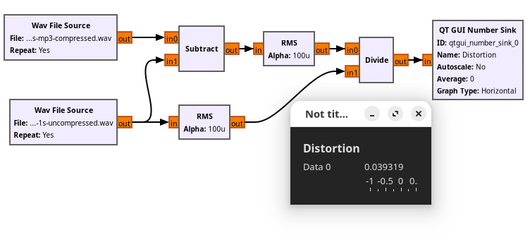

# A Distortion Analyser To Evaluate Audio Compression Algorithms

## Licence

This software is licensed under the [Creative Commons Attribution Share Alike 4.0 International licence](license.md).

The repository also contains two audio files derived from [Bongo_sound.wav](https://commons.wikimedia.org/wiki/File:Bongo_sound.wav), which is from MarleneAyni on Wikimedia Commons, and has a CC0 licence.
